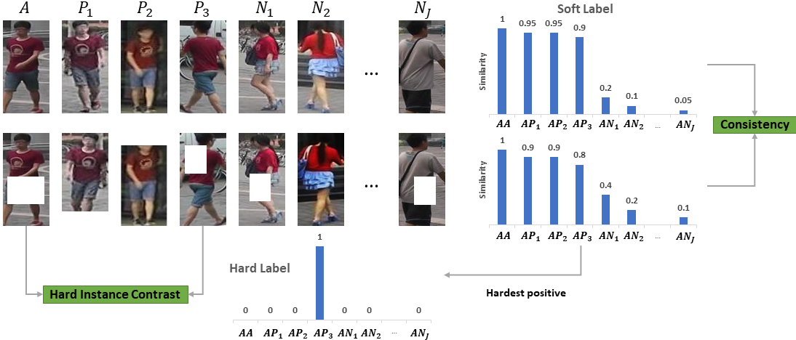

# ICE
This is the official PyTorch implementation of the ICCV 2021 paper
[ICE: Inter-instance Contrastive Encoding for Unsupervised Person
Re-identification](https://arxiv.org/pdf/2103.16364.pdf).




## Installation

```shell
git clone https://github.com/chenhao2345/ICE
cd ICE
python setup.py develop
```

## Prepare Datasets

Download the raw datasets [DukeMTMC-reID](https://arxiv.org/abs/1609.01775), [Market-1501](https://www.cv-foundation.org/openaccess/content_iccv_2015/papers/Zheng_Scalable_Person_Re-Identification_ICCV_2015_paper.pdf), [MSMT17](https://arxiv.org/abs/1711.08565),
and then unzip them under the directory like
```
ICE/examples/data
├── dukemtmc-reid
│   └── DukeMTMC-reID
├── market1501
└── msmt17
    └── MSMT17_V1(or MSMT17_V2)
```

## Training
We used **4 GPUs** to train our model.
 
Train [Market-1501](https://www.cv-foundation.org/openaccess/content_iccv_2015/papers/Zheng_Scalable_Person_Re-Identification_ICCV_2015_paper.pdf):
```
python examples/unsupervised_train.py --dataset-target market1501
```
Train [DukeMTMC-reID](https://arxiv.org/abs/1609.01775):
```
python examples/unsupervised_train.py --dataset-target dukemtmc-reid
```
Train [MSMT17](https://arxiv.org/abs/1711.08565):
```
python examples/unsupervised_train.py --dataset-target msmt17
```
## Citation
If you find this project useful, please kindly star our project and cite our paper.
```text
@article{chen2021ice,
  title={ICE: Inter-instance Contrastive Encoding for Unsupervised Person Re-identification},
  author={Chen, Hao and Lagadec, Benoit and Bremond, Francois},
  journal={arXiv preprint arXiv:2103.16364},
  year={2021}
}
```